# 🤖 MIRA - Multilingual Intelligent Research Assistant


> **An end-to-end multilingual Retrieval-Augmented Generation (RAG) research assistant that enables grounded question answering over PDF documents using local Large Language Models powered by Ollama.**

---

## 🚀 Overview

**MIRA (Multilingual Intelligent Research Assistant)** is an end-to-end **Generative AI application** built with **LangChain**, **LangGraph**, **ChromaDB**, and **Ollama**.

The application allows users to upload academic papers in PDF format and ask questions in either **English** or **Indonesian**. By combining semantic retrieval, query rewriting, and cross-encoder re-ranking, MIRA produces highly relevant answers while minimizing hallucinations through grounded generation.

Designed as a **fully local AI assistant**, MIRA ensures user privacy by processing all data on-device without relying on external cloud APIs.

---

# ✨ Features

- 📄 Upload and analyze academic PDF documents
- 🔍 Advanced Retrieval-Augmented Generation (RAG)
- 🧠 Query Rewriting for improved retrieval quality
- 🎯 Cross-Encoder Re-ranking for context optimization
- 🌐 Multilingual responses (English & Indonesian)
- 💬 Persistent chat history
- ⚡ Dynamic retrieval optimization based on available RAM
- 🏠 Fully local deployment with Ollama
- 🔒 Privacy-friendly architecture with offline processing
- 📚 Grounded answer generation to minimize hallucinations

---

# 🏗️ Architecture

<p align="center">  </p> <p align="center"> <em> End-to-End Retrieval-Augmented Generation (RAG) pipeline with query rewriting, semantic retrieval, cross-encoder re-ranking, and grounded answer generation using a local LLM powered by Ollama. </em> </p>

---

# 📚 Table of Contents

- Features
- Technology Stack
- System Requirements
- Installation
- Configuration
- Usage
- Project Structure
- Troubleshooting
- Performance
- Portfolio Highlights
- Future Improvements
- License

---

# 🛠️ Technology Stack

| Component            | Technology                            |
| -------------------- | ------------------------------------- |
| Programming Language | Python                                |
| LLM                  | Llama 3.2 3B (Ollama)                 |
| Embedding Model      | nomic-embed-text-v2-moe               |
| AI Framework         | LangChain                             |
| Workflow Engine      | LangGraph                             |
| Vector Database      | ChromaDB                              |
| Re-ranking           | Cross Encoder (MS MARCO MiniLM-L6-v2) |
| Frontend             | Streamlit                             |
| Package Manager      | uv                                    |
| PDF Processing       | PyPDF                                 |
| Local Deployment     | Ollama                                |

---

# 💻 System Requirements

## Minimum

- Python 3.10–3.12
- 8 GB RAM
- Windows / Linux / macOS
- 10 GB available storage

## Recommended

- 16–32 GB RAM
- NVIDIA GPU (8 GB VRAM or above)
- 20 GB storage

---

# 📦 Installation

## 1. Install Python

Ensure that **Python 3.10–3.12** is installed on your system.

Verify the installation:

```bash
python --version
```

or

```bash
python3 --version
```

---

## 2. Install uv Package Manager

MIRA uses **uv**, a fast Python package manager and replacement for `pip`.

### Windows (PowerShell)

```powershell
powershell -ExecutionPolicy ByPass -c "irm https://astral.sh/uv/install.ps1 | iex"
```

### macOS & Linux

```bash
curl -LsSf https://astral.sh/uv/install.sh | sh
```

Verify the installation:

```bash
uv --version
```

---

## Clone Repository

```bash
git clone https://github.com/HBEKS/MIRA.git

cd MIRA
```

---

## Install Ollama

### Windows

Download and install Ollama from:

https://ollama.com

### Linux/macOS

```bash
curl -fsSL https://ollama.com/install.sh | sh
```

---

## Download Models

```bash
# Main LLM

ollama pull llama3.2:3b

# Lightweight alternative

ollama pull gemma2:2b

# Embedding model

ollama pull nomic-embed-text-v2-moe
```

---

## Install Project Dependencies

If the repository includes a `uv.lock` file, simply run:

```bash
uv sync
```

This command will:

* 📦 Create a virtual environment (`mira`) automatically if it does not already exist.
* 📥 Install all project dependencies defined in `pyproject.toml` and `uv.lock`.
* 🔒 Ensure that every developer uses the exact same package versions for reproducible environments.

Once the installation is complete, activate the virtual environment:

### Windows (PowerShell)

```powershell
mira\Scripts\Activate.ps1
```

### Windows (Command Prompt)

```cmd
mira\Scripts\activate.bat
```

### macOS / Linux

```bash
source mira/bin/activate
```

After activation, your terminal prompt should look similar to:

```text
(mira) C:\Users\username\MIRA>
```

If the repository does not include a `uv.lock` file, install the dependencies manually:

```bash
uv add langchain langchain-ollama langchain-chroma chromadb

uv add langchain-community langchain-text-splitters

uv add streamlit pypdf python-dotenv

uv add langdetect tenacity

uv add sentence-transformers

uv add psutil torch
```

---

# ⚙️ Configuration

## Run Ollama

```bash
ollama serve
```

Verify installed models:

```bash
ollama list
```

---

## Optional Environment Variables

Create a `.env` file:

```env
OLLAMA_HOST=http://127.0.0.1:11434
```

---

## Automatic Hardware Optimization

| RAM      | Chunk Size | Retrieval K | Batch Size |
| -------- | ---------- | ----------- | ---------- |
| ≥32 GB   | 800        | 12          | 64         |
| 16–32 GB | 500        | 10          | 32         |
| <16 GB   | 300        | 8           | 16         |


---

# 🚀 Usage

Run the application:

```bash
uv run streamlit run ui/app.py
```

Open:

```
http://localhost:8501
```

---

## Workflow

1. Upload a PDF document.
2. Select the preferred output language.
3. Ask questions related to the document.
4. View persistent conversation history.

---

## Example Questions

```text
What methodology is used in this research?

Summarize the main findings.

Explain the proposed model architecture.

Compare the proposed method with baseline approaches.
```

---

# 📁 Project Structure

```text
MIRA/
│
├── agents/
│   ├── graph_mira.py              # LangGraph workflow definition
│   ├── nodes.py                   # RAG pipeline nodes
│   └── state.py                   # Shared state management
│
├── assets/
│   └── rag_pipeline_flowchart.svg # System architecture diagram
│
├── chat_history/                  # Automatically generated chat history
│   └── *.json
│
├── chroma_db_skripsi_cv/          # Chroma vector database (Computer Vision)
│
├── chroma_db_skripsi_ml/          # Chroma vector database (Machine Learning)
│
├── config/
│   └── settings.py                # Global application configuration
│
├── pipeline/
│   └── pdf_processor.py           # PDF parsing and vector indexing
│
├── ui/
│   └── app.py                     # Streamlit application entry point
│
├── utils/
│   ├── check_cuda.py              # CUDA availability checker
│   ├── rag_optimizer.py           # Query rewriting & re-ranking
│   └── system_check.py            # Hardware detection & optimization
│
├── .env                           # Environment variables (local)
├── .gitignore
├── .python-version
├── pyproject.toml                 # Project metadata & dependencies
├── uv.lock                        # Locked dependency versions
└── README.md
```

---

# 🔧 Troubleshooting

## Ollama Connection Error

```bash
ollama serve

ollama list

netstat -an | findstr "11434"
```

---

## Model Not Found

```bash
ollama pull llama3.2:3b

ollama pull nomic-embed-text-v2-moe

ollama list
```

---

## Out of Memory

Possible solutions:

- Switch to `gemma2:2b`
- Reduce `chunk_size`
- Reduce `k_retrieval`

---

# 📊 Performance

| Metric                  | Value       |
| ----------------------- | ----------- |
| PDF Indexing (30 pages) | 30–60 s     |
| Response Time           | 5–15 s      |
| RAG Accuracy            | 75–85%      |
| Maximum PDF Size        | 200 MB      |
| Deployment              | Fully Local |

---

# 💼 Portfolio Highlights

This project demonstrates expertise in:

- End-to-End Generative AI Development
- Retrieval-Augmented Generation (RAG)
- LangChain & LangGraph Workflow Orchestration
- Semantic Search Systems
- Cross-Encoder Re-ranking
- Local LLM Deployment
- Vector Database Integration
- Prompt Engineering
- AI Application Optimization
- Streamlit Full-Stack Development

Suitable for showcasing skills relevant to:

- AI Engineer
- Generative AI Engineer
- LLM Engineer
- Machine Learning Engineer
- NLP Engineer
- AI Software Engineer

---

# 🛣️ Future Improvements

- Multi-document Retrieval
- Hybrid Search (BM25 + Dense Retrieval)
- Citation Highlighting
- Agentic RAG Workflow
- Knowledge Graph Integration
- Voice-based Interaction
- Docker Support
- REST API
- Cloud Deployment
- Authentication & Multi-user Support

---

# 🤝 License

This project is licensed under the **MIT License**.

See the `LICENSE` file for more details.

---

# 🙏 Acknowledgements

- LangChain
- LangGraph
- Ollama
- ChromaDB
- Streamlit
- Sentence Transformers
- PyTorch

---

**Built with ❤️ using Python, LangChain, LangGraph, ChromaDB, Streamlit, and Ollama.**
